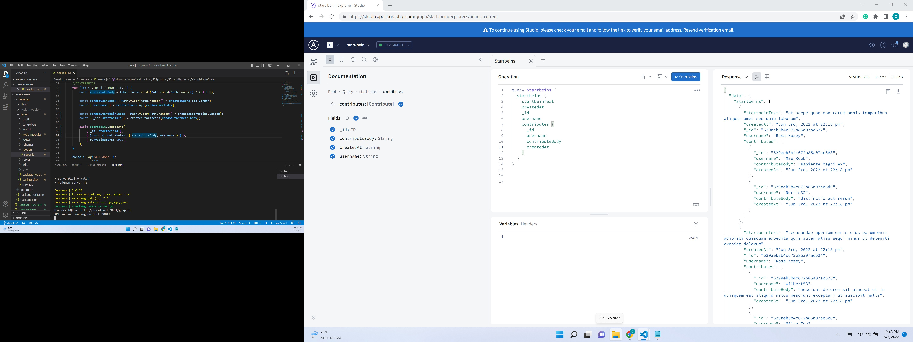
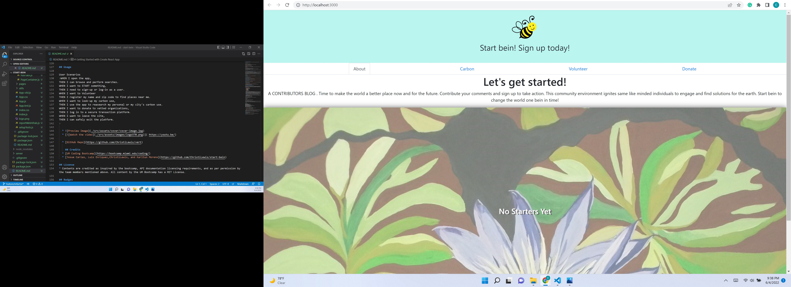

# [Start-bein!](https://youtu.be/tlxcVjjKCMw)

## Overview
Using a NoSQL database, Start bein's Mongoose models sync with its MongoDB database and React components so it can easily scale exponentially.  Although a brand new start-up, we go beyond all talk, thoughts, and prayers. Start bein promotes activity within and contribution to to the world at home and abroad. So, stop talkin, start bein!

## Contents
  * [Overview](#overview),
  * [Table of Contents](#contents),
  * [Description](#description),
  * [Installation](#installation),
  * [Notes](#notes),
  * [Usage](#usage),
  * [Credits](#credits),
  * [License](#license),
  * [Badges](#badges),
  * [Features](#features),
  * [Contribute](#contribute),
  * [Tests](#tests)

  ## Description
  * Did anyone else notice the animals venturing out into our locked down cities during the early days of Covid? What about the blue skies visible again in notoriously smoggy cities?
  * Social media apps have been a great resource for thinking, but what about being? We all know the cliche, "To be or not to be." Start bein advocates a balance between thinking and doing things as a way to start bein.
  * Let's face it, a safe place to pitch a topic or activity with the goal of positive "bein" by doing can only help balance the hardships broadcast daily.  It is not to ignore reality, but change a small part of your world one bein at a time. 
  * The best aspect of the code presented is that it builds both virtual and physical places to interact and make a difference. We use both external and internal data sources to promote the overall foundation of the app.
  * "It's not easy bein green as transformed.  Now it's about time to 'Start bein" in the world.

  ## Installation
  * As a full stack M-E-R-N application, there is no special installation required for the general us of the start-bein app. Technologies incorporated are a part of the thrird and final project of the six month odyssey of the full-stack bootcamp sponsored by the University of Miami:
  Use React for the front end.

>Use GraphQL with a Node.js and Express.js server.

Use MongoDB and the Mongoose ODM for the database.

Use queries and mutations for retrieving, adding, updating, and deleting data.

Be deployed using Heroku (with data).

Have a polished UI.

Be responsive.

Be interactive (i.e., accept and respond to user input).

Include authentication (JWT).

Protect sensitive API key information on the server.

Have a clean repository that meets quality coding standards (file structure, naming conventions, best practices for class and id naming conventions, indentation, high-quality comments, etc.).

Have a high-quality README (with unique name, description, technologies used, screenshot, and link to deployed application).
>

## Usage

User Scenarios
>WHEN I open the app, 
THEN I can browse and perform searches.
WHEN I want to START something,
THEN I need to sign-up or log-in as a user.
WHEN I want to Volunteer
THEN I register my name and zip code to find places near me.
WHEN I want to look-up my carbon use, 
THEN I use the app to reasearch my personal or my city's carbon use.
WHEN I want to donate to vetted organizations,
THEN I log in to a secure transaction platform.
WHEN I want to leave the site,
THEN I can safely exit the platform. 
>

  * 
  * 

  * [GitHub Repo](https://github.com/ChristiLewis/start-bein)

    ## Credits
  * [UM Coding Bootcamp](https://bootcamp.miami.edu/coding/)
  * [Josue Carias, Luis Enriquez,ChristiLewis, and Karltun Moreno](https://github.com/ChristiLewis/start-bein)

## License
* Contents are credited as inspired by the bootcamp, API documentation licensing requirements, and as per permission by the team members mentioned above. All content by the UM Bootcamp has a MIT License.

## Badges
* There are no badges generated at this time. For more information: [shields.io](https://shields.io/)

## Features
* Realtime, anywhere interactions
* Offline input stored and synced once back online in Realtime.

## How-to-Contribute
* Any recommendations?  Please see [contributorCovenant](https://www.contributor-covenant.org)

## Tests
* There are no tests at this time, we are open to suggestions.
  